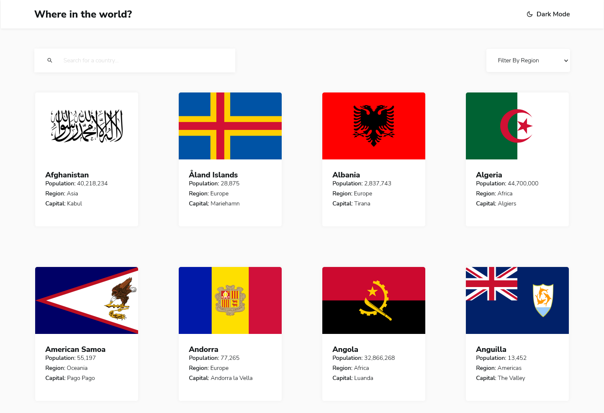

# Frontend Mentor - REST Countries API with color theme switcher solution

This is a solution to the [REST Countries API with color theme switcher challenge on Frontend Mentor](https://www.frontendmentor.io/challenges/rest-countries-api-with-color-theme-switcher-5cacc469fec04111f7b848ca). Frontend Mentor challenges help you improve your coding skills by building realistic projects.

## Overview

### Screenshot

### Links

-   Solution URL: [Github](https://github.com/MarcinFiuk/rest-countries-api)
-   Live Site URL: [Vercel](https://rest-countries-a9bqj3any-marcinfiuk.vercel.app/)

### Built with

-   Semantic HTML5 markup
-   CSS custom properties
-   Flexbox
-   CSS Grid
-   Mobile-first workflow
-   [React](https://reactjs.org/) - JS library
-   [Styled Components](https://styled-components.com/) - For styles
-   [Axios](https://axios-http.com/) - For fetching data
-   [Fuse.js](https://fusejs.io/) - For finding strings that are approximately equal to a given pattern
-   [React-icons](https://react-icons.github.io/react-icons/) - For icons

### What I learned

I learnt a few new concepts:

-   Race condition and how to prevent it
-   Debouncing and Throttling
-   About Fuse.js library

## Author

-   Frontend Mentor - [@MarcinFiuk](https://www.frontendmentor.io/profile/MarcinFiuk)
-   Twitter - [@marcin_fiuk](https://twitter.com/marcin_fiuk)

## Acknowledgments

Thank you to my mentor [Alex](https://www.linkedin.com/in/alexrohleder/) for feedback and guidance on this project.
